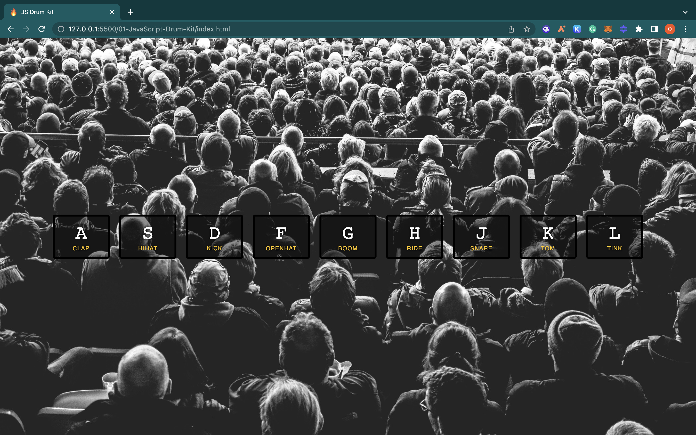
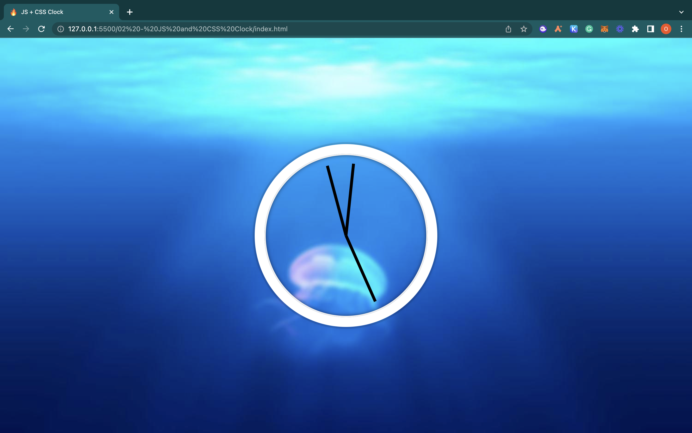
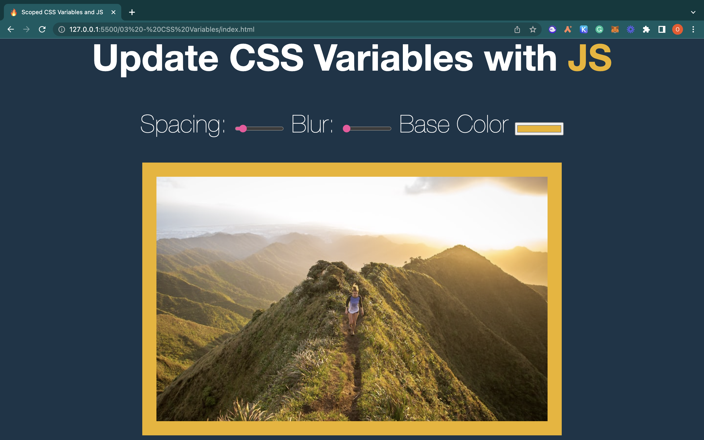
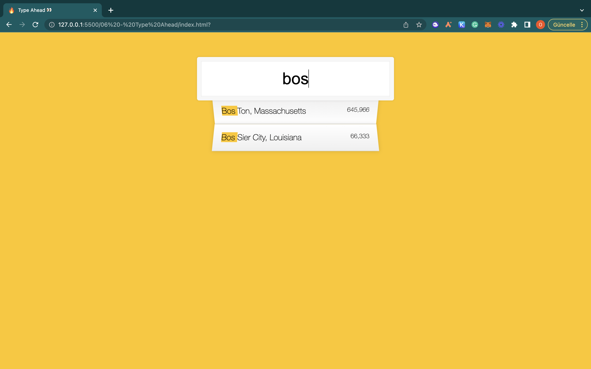
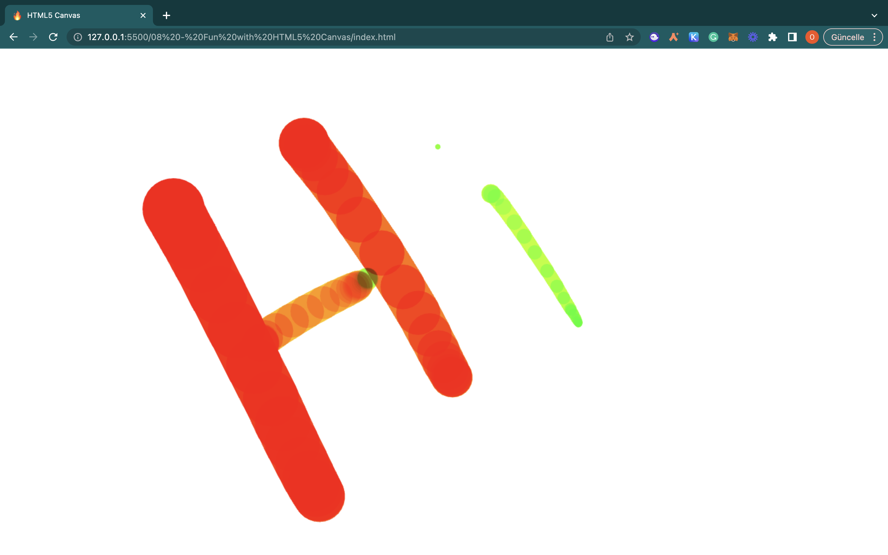
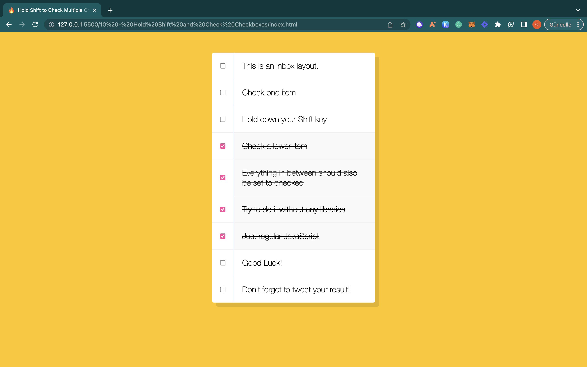

# 30 Day JavaScript Challenge

## Day 1

Bugün geliştirdiğim uygulamada EventListener kullanarak klavye tuşlarına basıldığında ilgili sesin çalınmasını ve DOM manipülasyonunu kullanarak ilgili tuşları ve sesleri seçmeyi deneyimledim. 
## Day 2

İkinci günün challenge'ında setInterval fonksiyonu ile her saniye setDate fonksiyonunun çağrılması ve Date nesnesinin kullanımıyla saniye, dakika ve saat kollarının açılarının hesaplanmasını sağladık. Böylece güncel saat değerlerine göre alog saati dinamik hale getirmiş olduk.

## Day 3

DOM elamanına sonradan ekleyebildiğimiz data-sizing  attribute'unu javascript kullanarak kullanıncının istediği değere göre ayarlamasına olanak sağlayan resmin blur,padding ve background özelliklerini değiştirebildiğimiz bir çalışma gerçekleştirdik.Bugun öğrendiğim önemli şeylerden biri DOM elamanlarını tutan arraylere göre çok daha kısıtlı işlevleri olan bir liste çeşidi olan NodeList oldu.

## Day 4

Array cardio günü ...

## Day 5

Resmin üzerine tıklandığında ilgili resmin büyümesini ve css'in transform özelliğinden yararlanarak ekranda gözükmeyen yazıların efekt ile ekrana gelmesini sağlayan bir web uygulaması geliştirdik.JavaScript kullanarak kullanıcı etkileşimlerinin dinlenmesi ve gerektiğinde ilgili sınıfların eklenip çıkarılmasını sağladık.

## Day 6

Kullanıcının yazdığı kelimeye göre API'de bulunan şehirleri ve eyaletleri filtreleyebildiğimiz bir şehir arama ara yüzü geliştirdik.Burada verileri API'den çekebilmek için fetch fonksiyonunu kullandık .Bugün temel şeylerden biri RegExp ile kullanılan "gi" ifadesi oldu .Burada "g"(global) ifadeyle eşleşen bütün verilerin bulunmasını sağladığını "i"(ignore case) büyük küçük harf duyarlılığını devre dışı bırakmak için kullanıldığını öğrendim.

## Day 7

Array cardio günü ...

## Day 8

HTML5'in canvas tagini kullanarak mouse'un hareketlerini addEventListener kullanarak dinleyerek çizim yapabileceğimiz bir web uygulaması geliştirdik.

## Day 9

Console.log dışında consolda kullanabileceğim özellikleri deneyimledim.

## Day 10

Shift tuşuna basılması ile seçili olan ifadelerin arasındaki ifadelerin otomatik olarak seçildiği basit bir mailbox örneği geliştirdik.